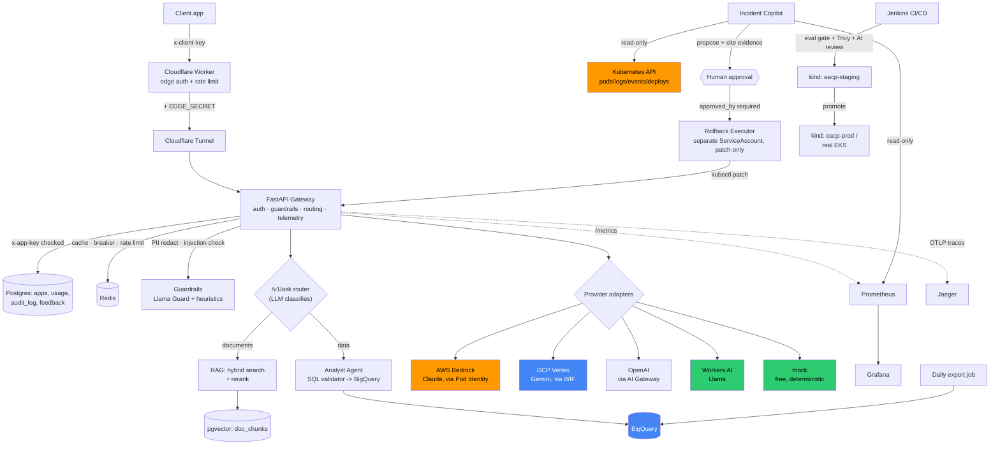

# architecture.md — how this is put together

This is the "how it's wired" doc — request paths, trust boundaries, tech stack, and how the
folders relate. Read this before touching auth, routing, or infra; it's the doc that would have
saved real debugging time in Part 9 (the AWS Pod Identity / GCP WIF cross-cloud auth chain).

For *what* we're building and *why*, see `project_breif.md` (acts as the PRD). For hard rules
Claude must follow, see `CLAUDE.md`. For per-part status/history, see `PROGRESS.md`.

## Request path (production target, real end-to-end as of Part 9)

```
client app
  -> Cloudflare Worker         (edge: checks x-client-key, injects EDGE_SECRET, proxies)
  -> Cloudflare Tunnel         (cloudflared — local process in dev, in-cluster pod on EKS)
  -> FastAPI gateway           (auth, guardrails, routing, telemetry — see gateway/app/main.py)
  -> provider adapter          (gateway/app/providers/*.py — uniform ChatResult interface)
  -> AI provider               (Bedrock / Vertex / OpenAI / Workers AI / mock)
```

Every hop this: Worker never talks to a provider directly; the gateway never trusts a request
without a valid `x-app-key` (checked against the `apps` table, see Auth below); providers are
swappable behind `app/providers/base.py`'s shared interface without touching routing logic.

## Full system diagram

The ASCII path above is the Part 1 core. By Part 13 the real system looks like this — every box
below is something actually built and verified, not aspirational:



Color key: orange = AWS-billed, blue = GCP-billed, green = free/local. Everything else (Worker,
Tunnel, gateway, Postgres, Redis, Jenkins) runs free either on Cloudflare's free tier or locally.

## Auth — three separate trust chains, don't conflate them

1. **Edge (Worker -> Gateway)**: `EDGE_SECRET`, a shared secret the Worker injects and the
   gateway checks, proving the request actually came through the Worker and not directly.
2. **App (client -> Gateway)**: `x-app-key` header, hashed (SHA256) and checked against the
   `apps` table (`gateway/app/auth.py`). Each app has a role and a provider allow-list.
3. **Cloud (Gateway -> Provider)**: this is the one that bit us in Part 9 — there are TWO
   separate cloud identity mechanisms, not one:
   - **AWS (Bedrock)**: EKS Pod Identity. The pod's service account (`eacp-gateway`) is
     associated with IAM role `eacp-gateway-role` via `aws_eks_pod_identity_association`
     (`terraform/aws/eks.tf`). Requires the EKS Pod Identity Agent add-on installed on the
     cluster, and the role's trust policy must explicitly trust `pods.eks.amazonaws.com`
     (NOT `eks.amazonaws.com` — a subtle, easy-to-get-wrong distinction).
   - **GCP (Vertex)**: Workload Identity Federation (WIF) layered ON TOP of the AWS identity
     above — the gateway uses its AWS role credentials to get a GCP token via a trust pool
     (`eacp-aws-pool`/`eacp-aws-provider`), then impersonates a GCP service account
     (`eacp-vertex-sa`). This is real cross-cloud identity chaining: AWS Pod Identity ->
     boto3 credentials -> Google STS token exchange -> GCP service account impersonation.
     **Status: unresolved as of Part 9** — the impersonation step fails with a permission
     error not yet root-caused; Bedrock's simpler single-cloud path works, Vertex's
     cross-cloud path currently doesn't when running on EKS. Local dev (ADC) is unaffected.
   - Locally (not on AWS), Vertex just uses `gcloud auth application-default login` — no
     cloud identity chaining needed, since there's no AWS identity to start from.

## Tech stack and why

| Layer | Choice | Why (see PROGRESS.md per-part logs for the full reasoning) |
|---|---|---|
| Gateway | Python + FastAPI | async, typed, fast to stand up, native OpenAPI |
| Edge | Cloudflare Worker + Tunnel | no public IP/port-forwarding needed from a laptop |
| Usage/audit data | Postgres (+pgvector) | one DB for both relational (usage, apps) and vector (RAG chunks) data |
| Cache/rate-limit/breaker state | Redis | fast, ephemeral, already the right tool for all three uses |
| Local orchestration | Docker + kind | free, fast iteration, same Kubernetes primitives as prod |
| Production orchestration | AWS EKS | real, publicly-reachable, always-on (see PROGRESS.md Part 9) |
| IaC | Terraform (aws + google providers) | plan/apply/destroy discipline, repeatable, auditable |

## Folder map

```
gateway/
  app/
    main.py          # FastAPI routes — /health, /v1/chat*, /v1/rag/ask, /v1/extract/document
    config.py         # env var reads, no secrets committed
    auth.py           # app key hashing + verification, role/provider allow-lists
    guardrails.py      # PII redaction, prompt-injection detection (heuristic + Llama Guard)
    rate_limit.py      # Redis-backed per-app rate limiting
    routing.py          # fallback chains, circuit breaker, cache, canary weighting
    retrieval.py         # RAG: vector/keyword/hybrid search + reranking
    db.py                 # SQLAlchemy models: Usage, App, AuditLog, DocChunk
    providers/              # one adapter per AI provider, uniform ChatResult interface
  routing.yaml               # task -> candidate providers, retry/breaker/canary config
worker/
  src/index.ts                # edge key check, EDGE_SECRET injection, proxy to gateway
k8s/
  eacp-chart/                   # Helm chart for LOCAL kind deployment (in-cluster Postgres)
  eks-manifests/                  # plain manifests for REAL EKS deployment (RDS, not in-cluster PG)
terraform/
  aws/                               # EKS, RDS, ECR, IAM, VPC — plan/apply/destroy per Part 9 rules
  gcp/                                 # BigQuery datasets — applied (free tier)
evals/                                   # golden dataset, scorecard, retrieval eval, canary check
docs/                                      # synthetic policy/runbook docs for the RAG system
```

Note `k8s/eacp-chart` (local) and `k8s/eks-manifests` (real AWS) are deliberately separate, not
one parameterized chart — local uses an in-cluster Postgres pod, EKS uses real RDS, and local
has no Pod Identity to configure. Unifying them would be premature given EKS is only spun up for
bounded, billed sessions (Part 9, Part 13), not day-to-day work.

## Keeping this current

This file decays if it's not updated. Update it when: a new trust boundary is added, a provider
changes its adapter shape, or a folder's purpose changes. If in doubt whether this file is still
accurate, check `PROGRESS.md`'s most recent part log against it — `PROGRESS.md` is updated every
part and is the more reliable source if the two ever disagree.
